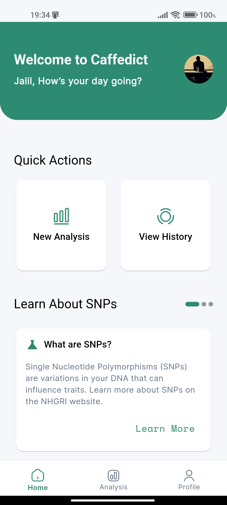
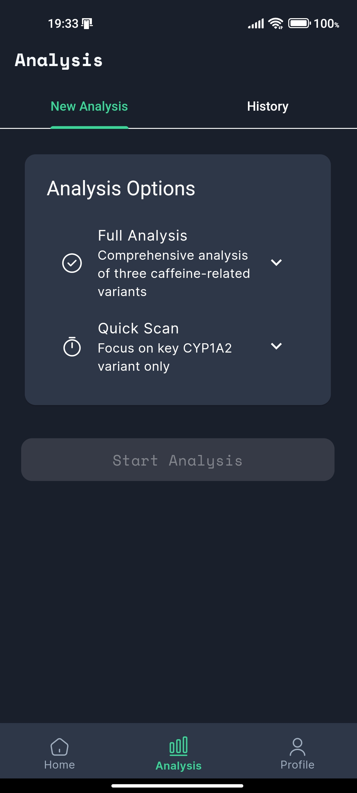
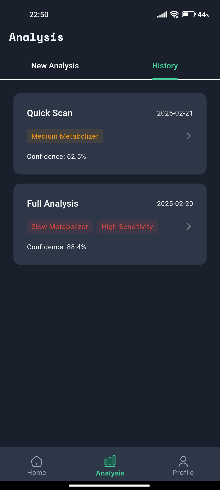
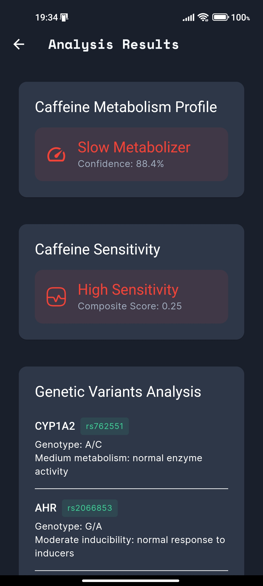

# Caffedict

<div align="center">
    
*Get Insights on Caffeine Metabolism with AI-Powered SNP Analysis*

[Features](#features) · [Installation](#installation) · [Documentation](#documentation) · [Contact](#contact)

</div>

## Overview

Caffedict is a proof-of-concept mobile application, developed as an experiment, and potential showcase that integrates genetics knowledge, machine learning techniques to provide insights into caffeine metabolism based on SNP variants analysis. Developed using Flutter, it utilizes a deep learning model to analyze well-documented SNP variants in the **CYP1A2, AHR,** and **ADORA2A** genes, offering users feedbacks and recommendations on caffeine intake, timing, and sensitivity management.

You can download the app and try it from this [Drive Link](https://drive.google.com/file/d/1oIX1TCQ2qlgCZyQuZPy-TNOsdKMA0gwn/view) (to be added), or explore its UI and features below:

<details>
<summary><strong>Onboarding</strong></summary>

<div align="center">
  
  
  
</div>

</details>

<details>
<summary><strong>Authentication Flow</strong></summary>

<div align="center">
  
  
  
</div>

</details>

<details>
<summary><strong>Get Started</strong></summary>

<div align="center">
  
  
  
  
</div>

</details>

<details>
<summary><strong>Main Features</strong></summary>

<div align="center">
  
  
  
  
  
</div>

</details>

<details>
<summary><strong>User Profile</strong></summary>

<div align="center">
  
  
</div>

</details>

<details>
<summary><strong>Guest Mode</strong></summary>

<div align="center">
  
  
</div>

</details>

## Features

### 👩‍🔬 Core Capabilities

- **Onboarding & Introduction**
  - Educational slides on SNPs and caffeine metabolism
  - Explanation of the AI model and its function
  - Sample analysis demonstration

- **Authentication**
  - Email/password registration and login
  - Google Sign-In
  - Guest mode with limited access

- **Home Screen**
  - Quick access to analysis and history
  - Learning section about SNP with URL resources
  - Latest analysis preview

- **Analysis**
  - **Quick Scan:** Upload a **CYP1A2** `.vcf` file for a rapid assessment
  - **Full Analysis:** Upload `.vcf` files for **CYP1A2, AHR,** and **ADORA2A** for a detailed report

- **Results & Insights**
  - Classification into **fast, medium, or slow caffeine metabolism**
  - Genotype detection and analysis
  - Feedbacks and recommendations on coffee consumption timing, dosage, and sensitivity management

- **Profile & Settings**
  - Upload/update profile picture and username
  - Change password
  - Delete data or account
  - Privacy Policy
  - About Caffedict
  - Terms of Service
  - Sign out

### Future Enhancements

- **Expanded Analysis for Additional Genetic Markers**
- **Improved AI Model with More Genetic Variants**

## Technical Stack

- **Frontend:** Flutter
- **Backend:** Supabase
- **State Management:** GetX
- **Machine Learning Model:** Dense Layer Neural Network
- **Key Packages:**
  - supabase_flutter
  - get
  - firebase_core
  - connectivity_plus
  - get_storage
  - image_picker
  - file_picker
  - tflite_flutter

## Installation

```bash
# Clone the repository
git clone https://github.com/jaliil-9/Caffedict---SNP-Variants-Analysis-Flutter-App-.git

# Navigate to project directory
cd caffedict

# Install dependencies
flutter pub get

# Run the app
flutter run
```

### System Requirements

- Flutter 3.27.0
- Android Studio / VS Code
- Android SDK with:
  - Java version 17
  - Gradle 8.10.2

## Documentation

For detailed documentation, please see:
- [User Guide](docs/USER_GUIDE.md)
- [Technical Documentation](docs/TECHNICAL.md)

## Sample Files

To test the app's features, a folder containing 3 `.vcf` files for different genes is available:
- `samples/CYP1A2.vcf`
- `samples/AHR.vcf`
- `samples/ADORA2A.vcf`

## About the Developer

I am Abdeldjalil Bouziane, a Biotechnology Engineer specializing in Health Biotechnology, with expertise in:
- Cross-platform Mobile Development (Flutter)
- Machine Learning and Deep Learning
- Genetic Data Analysis

## Contact

- Email: jalilbouziane@protonmail.com
- LinkedIn: [Abdeldjalil Bouziane](https://www.linkedin.com/in/abdeldjalil-bouziane-0a7079288/)

## License

This project is licensed under the MIT License - see the [LICENSE](LICENSE) file for details.

